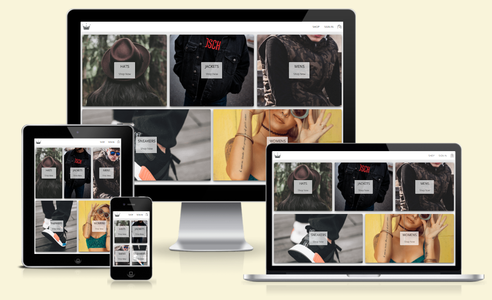

# Crown Clothing

A React project focused on practicing E-commerce functionalities, based on [ZTM-Complete React Developer](https://zerotomastery.io/courses/learn-react/) course.

---

### preview:

 

### [live demo](https://sean-jiang-ztm-crwn-clothing-v2.netlify.app/)

## Available scripts

| Script       | Description                                         |
| ------------ | --------------------------------------------------- |
| npm dev-sls  | Start the development server with netlify functions |
| npm build    | Build the production-ready code                     |
| npm test     | Start testing and watch changes via vitest          |
| npm coverage | Run tests and get current code coverage             |

## This project utilizes the following technologies:

- [Vite](https://vitejs.dev/): A build tool for modern web development.
- [TypeScript](https://www.typescriptlang.org/): A typed superset of JavaScript that compiles to plain JavaScript.
- [React](https://react.dev/): A JavaScript library for building user interfaces.
- [Redux](https://redux.js.org/): A predictable state container for JavaScript apps.
- [React Router](https://reactrouter.com/): A library for routing in React applications.
- [Firebase](https://firebase.google.com/): A cloud-based platform for building web and mobile applications.
- [Stripe](https://stripe.com/): A payment processing platform for online businesses.
- [Netlify](https://www.netlify.com/): A cloud computing company that offers hosting and serverless backend services.
- [GraphQL](https://graphql.org/): A query language for APIs and a runtime for executing those queries with your existing data.
- [GitHub Actions](https://github.com/features/actions): A CI/CD platform that allows you to automate your software development workflows.
- [Testing Library](https://testing-library.com/): A set of utilities for testing UI components in a way that resembles how the components are used by end users.

## Special Thanks

- [ZTM](https://zerotomastery.io/): Thanks to these outstanding courses, I gained valuable knowledge throughout the journey.
- Service and platform providers.
- All individuals who have contributed packages utilized by this project.
