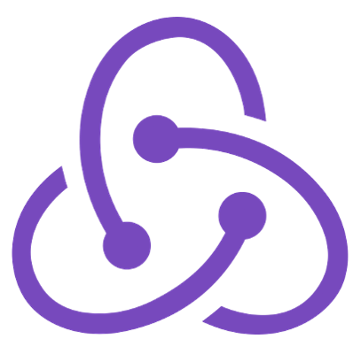

# Crown Clothing

A React project focused on practicing E-commerce functionalities, based on [ZTM-Complete React Developer](https://zerotomastery.io/courses/learn-react/) course.

---

[](https://github.com/seanjiangsh/ztm-crwn-clothing-v2/actions)
[](https://github.com/seanjiangsh/ztm-crwn-clothing-v2/actions/workflows/test.yml)
[](https://app.netlify.com/sites/sean-jiang-ztm-crwn-clothing-v2/deploys)
[](https://github.com/seanjiangsh/ztm-crwn-clothing-v2/actions/workflows/deploy.yml)

### preview:

 

### [live demo](https://crwn-clothing.sean-j.dev/)

## Getting started

```bash
# install dependencies
npm install && npm run install-sls

# start dev server at http://localhost:5173
npm run dev:sls
```

### Available scripts

| Script              | Description                                                                                      |
| ------------------- | ------------------------------------------------------------------------------------------------ |
| npm run dev:sls     | Start the development server (http://localhost:5173) with AWS lambda API (http://localhost:3000) |
| npm run dev:netlify | Start the development server using Netlify API at http://localhost:8888                          |
| npm build           | Build the production-ready code                                                                  |
| npm test            | Start testing and watch changes via vitest                                                       |
| npm coverage        | Run tests and get current code coverage                                                          |

## This project utilizes the following technologies:

### Frontend

  <div >
    <a href="https://react.dev" target="_blank" rel="noreferrer"></a>
    <a href="https://redux.js.org" target="_blank" rel="noreferrer"></a>
    <a href="https://vitejs.dev" target="_blank" rel="noreferrer"></a>
    <a href="https://www.typescriptlang.org" target="_blank" rel="noreferrer"></a>
  </div>

### Backend, Authorization and Payment

  <div >
    <a href="https://graphql.org" target="_blank" rel="noreferrer"></a>
    <a href="https://firebase.google.com" target="_blank" rel="noreferrer"></a>
    <a href="https://stripe.com" target="_blank" rel="noreferrer"></a>
  </div>

### Cloud

  <div >
    <a href="https://aws.amazon.com" target="_blank" rel="noreferrer"></a>
    <a href="https://aws.amazon.com/lambda" target="_blank" rel="noreferrer"></a>
    <a href="https://www.netlify.com" target="_blank" rel="noreferrer"></a>
  </div>

### CI/CD

  <div >
    <a href="https://vitest.dev" target="_blank" rel="noreferrer"></a>
    <a href="https://github.com/features/actions" target="_blank" rel="noreferrer"></a>
    <a href="https://arc.codes" target="_blank" rel="noreferrer"></a>
  </div>

## Thanks to:

- [ZTM](https://zerotomastery.io/): Thanks to these outstanding courses, I gained valuable knowledge throughout the journey.
- Service and platform providers.
- All individuals who have contributed packages utilized by this project.
